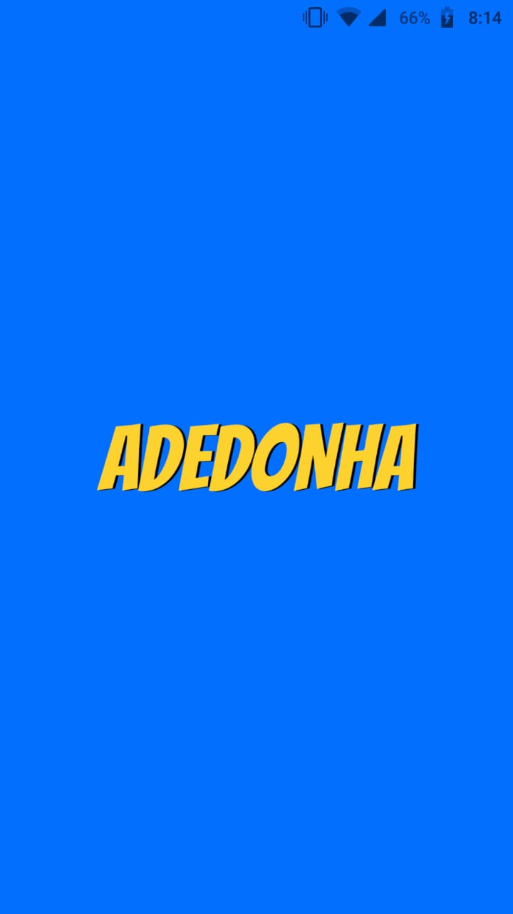
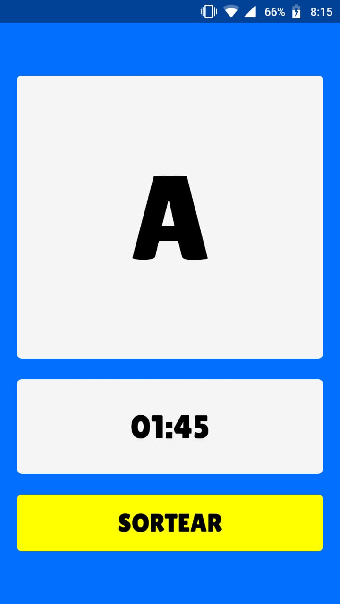

# Adedonha

This app was created for help me and my family on a game called "Adedonha" or "Stop" drawing a letter and counting the time.

## Made with

* [Expo](https://expo.io/)
* [Google Fonts](https://fonts.google.com/)
* [React Native](https://reactnative.dev/)
* [Visual Studio Code](https://code.visualstudio.com/)

## Screenshots

<center>
<span>


</span>
</center>

## How to use

```bash
# clone this repository
git clone https://github.com/fredcoutinho52/adedonha.git

# install the dependencies
npm install

# run the app on expo or on an emulator
npm start
```

## License

[MIT License](https://opensource.org/licenses/MIT)